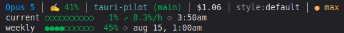

# Claude Line

[](https://github.com/mpiton/claude-statusline/actions/workflows/ci.yml)

Configure your Claude Code statusline to show limits, directory and git info



## Install

Run the command below to set it up

```bash
npx @mpiton/claude-line
```

It backs up your old status line if any, copies the status line script to
`~/.claude/statusline.sh`, and configures your Claude Code settings.

The installed copy carries the release it came from on its second line:

```bash
sed -n 2p ~/.claude/statusline.sh    # => # statusline-version: 2.0.0
```

Rerun the install command to update it. A copy that is already current is left
where it is, and an older one of ours is replaced rather than backed up — only
a statusline you wrote yourself ends up in `statusline.sh.bak`.

## Requirements

- [jq](https://jqlang.github.io/jq/) — for parsing JSON
- curl — for fetching rate limit data
- git — for branch info

On macOS:

```bash
brew install jq
```

On Windows the statusline runs under the bash that Git for Windows ships, which
brings curl and git with it. jq you install yourself:

```bash
winget install jqlang.jq
```

## Windows

Claude Code runs the status line through `cmd.exe`, which has no `bash` on PATH
— Git for Windows only puts its `cmd` directory there, and the `bash.exe`
Windows itself ships launches WSL. So the installer looks for the bash Git for
Windows installs and writes its full path, along with the full path of the
script, into `settings.json`:

```json
"statusLine": {
  "type": "command",
  "command": "\"C:\\Program Files\\Git\\bin\\bash.exe\" \"C:/Users/you/.claude/statusline.sh\""
}
```

It searches next to the `git` on your PATH, then the usual install locations.
Set `CLAUDE_LINE_BASH` to a `bash.exe` to choose one yourself. Use the copy in
`Git\bin` rather than `Git\usr\bin`: the second starts without `/usr/bin` on
PATH, so jq, curl and the coreutils the script calls all come back missing.

## Profiles

Claude Code reads its configuration from `CLAUDE_CONFIG_DIR` when that is set,
and from `~/.claude` otherwise. Both the installer and the status line follow
it, so a second profile is installed by pointing at it:

```bash
CLAUDE_CONFIG_DIR=~/.claude-work npx @mpiton/claude-line
```

That profile then keeps its own `statusline.sh`, `statusline.json`,
`settings.json` and credentials, and only the profile named at install time is
touched. Claude Code renders the status line on its own events; if the first
render of a session lags behind, `"refreshInterval": 5` in the `statusLine`
block re-runs the command every five seconds as well.

## Cache

Rate limit responses, the git dirty flag and how far the skills block has read
the transcript are cached in
`${XDG_CACHE_HOME:-~/.cache}/claude-statusline`, created private to you.
`CLAUDE_STATUSLINE_CACHE_DIR` moves it. A directory that is a symlink, or that
another user owns, is left alone and caching is skipped for that run. Inside a
directory that passes, each cache file is checked the same way, so a file
planted before the first render is neither read nor written through.

The five-hour line adds a burn rate after one minute of observations. Samples
are kept at most once a minute, only for the current reset window, and age out
after five hours. The pace is green when its projection stays below 90% at the
reset, yellow for 90–99%, and red when it would exhaust the allowance first.

## Configuration

Create `~/.claude/statusline.json` to override the defaults. The example below
shows every supported setting; omitted keys keep their built-in value.

```json
{
  "blocks": [
    "model", "context", "directory", "cost", "changes", "style", "skills",
    "effort", "current", "burn", "weekly", "extra"
  ],
  "bar_width": 10,
  "skills_limit": 3,
  "colors": {
    "blue": "#0099ff",
    "orange": "#ffb055",
    "green": "#00af50",
    "cyan": "#56b6c2",
    "red": "#ff5555",
    "yellow": "#e6c800",
    "white": "#dcdcdc",
    "magenta": "#b48cff"
  }
}
```

Blocks always render in the order above; the array only selects them. `burn`
is part of `current`, and has no effect when `current` is hidden. `bar_width`
accepts integers from 1 to 40 and colors accept `#RRGGBB`. Invalid values are
ignored. Set `CLAUDE_STATUSLINE_CONFIG` to use another file.

`skills` is the one block not in the default set — name it in `blocks` to turn
it on:

```
Opus 5 │ ✍️ 25% │ my-repo (main) │ skills:human-writer,artifact-design,pdf +1
```

Claude Code sends no skill list on stdin, so the names come from the session
transcript, where every invocation is a `Skill` tool call. That means skills
the session invoked, in the order it first invoked them, not skills available
to it. The most recent `skills_limit` are named — 1 to 10, 3 by default — and
the rest become the `+N`. Only the part of the transcript written since the
last render is read, so the block costs a few milliseconds however long the
session runs.

## Tests

```bash
npm test                   # everything
npm run lint               # shellcheck
bash test/run.sh effort    # only cases whose name contains "effort"
```

`test/run.sh` pipes a statusline JSON payload into `bin/statusline.sh` and checks what it renders. The run is sandboxed — `TZ` is pinned to UTC, `HOME` and the usage cache point at a temp dir, and `curl` is stubbed — so nothing touches the network or your real config. Cases that need a comma-decimal locale are skipped if none is installed.

`test/install.sh` runs `bin/install.js` against a throwaway `HOME` and checks the install, the uninstall and the backup round-trip.

Both take a filter argument. CI runs shellcheck, then the full suite on Linux, macOS and Windows/Git Bash.

## Uninstall

```bash
npx @mpiton/claude-line --uninstall
```

If you had a previous statusline, it restores it from the backup. Otherwise it
removes the script and cleans up your settings. The uninstaller only changes a
versioned copy from this package, or an exact copy of one of its pre-versioned
npm releases; an unknown script or custom setting is left alone.

## License

MIT
